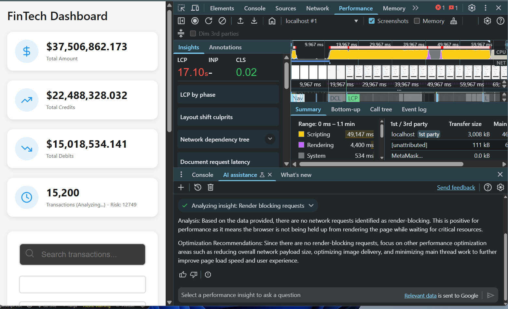
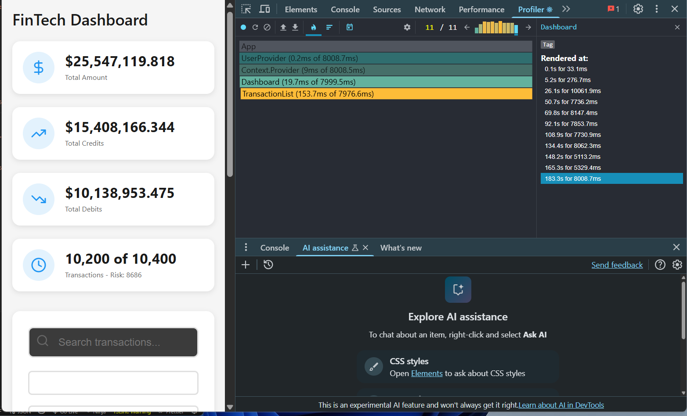

# FinTech Dashboard - Frontend Assessment Submission

## Performance Optimization
Using the chrome performance tool I noticed:
- Slow page load on startup
- Page load buggy and difficulty in scrolling

> Chrome Performance Analysis

 The Largest Contentful Paint (LCP) for the page was very high at 17,096.94 ms (`though it varied, some instance took 11,000 ms while others took about 19000 ms`. The LCP element is text-based and not a network resource. While the initial document request passed the server response time check (download complete at 343.17 ms) and was not redirected, it failed the compression check. The main thread processing time for the document was significantly long at 1,210.68 ms.

**CPU BLOCKING**

The main thread activity showed a large task with a duration of 23351 ms, which includes significant "Function call" activity (23350.7 ms) related to rendering and potentially other script execution. Specifically, there were multiple calls to performWorkUntilDeadline, flushWork, and workLoop from chunk-LAV6FB6A.js. There is also a long task (5367.4 ms) which includes `generateRiskAssessment` from `analyticsEngine.ts file` taking 2603.4 ms. Another significant main thread activity is related to parsing HTML (1190.4 ms) and evaluating a script from a Chrome extension (739 ms). There is also a 4166.9 ms task that includes significant time spent on "Recalculate style" (617.5 ms), "Layout" (3204.3 ms), and "Pre-paint" (344 ms).

> Analysis Images Before Optimisation

# These two images displays a very high Largest Contentful Paint.

___

# Profiler Analytics Review
### The top right chat indicates a high rendering of the **Transaction List** component

___ 

**Optimization Advise**:
- Optimize or defer the execution of the loadInitialData function in Dashboard.tsx and the generateRiskAssessment and calculateFraudScores functions in analyticsEngine.ts to reduce main thread blocking time by:
    - refactoring the flow.
    - adding __useEffect__ cleanups
    - included `requestIdleCallback` callback to handle data generation without blocking the main thread
    - employed data generation in chunks to prevent overload
- Breaking up long-running JavaScript tasks into smaller chunks to prevent them from blocking the main thread for extended periods.
- Empoyed the use of __paginated render__

On the search bar, I added debounced input to prevent expensive filtering every keystroke

