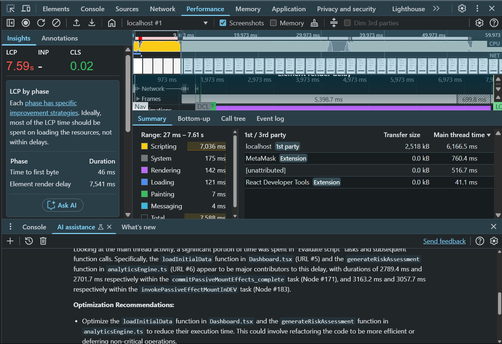
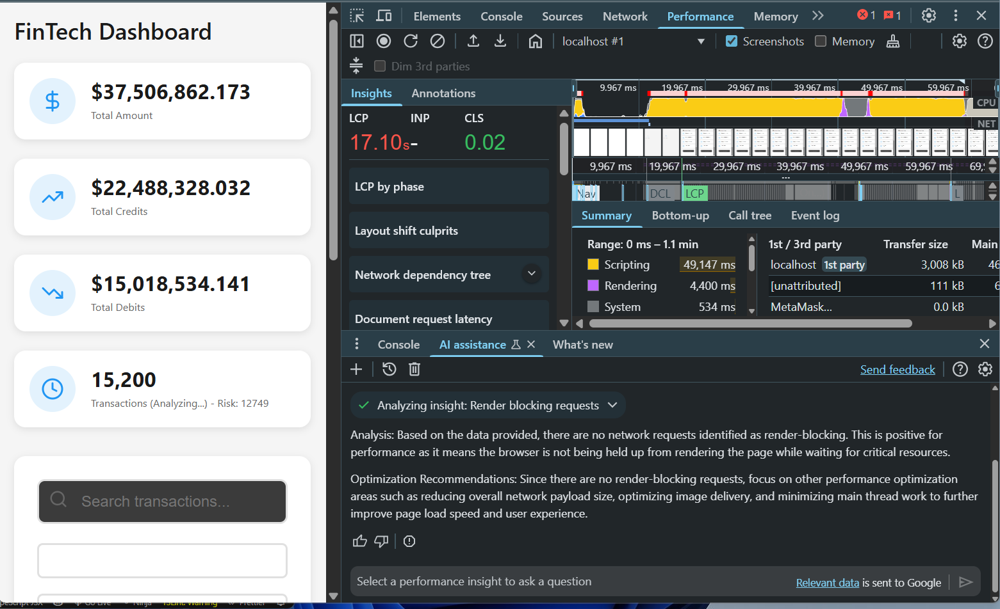
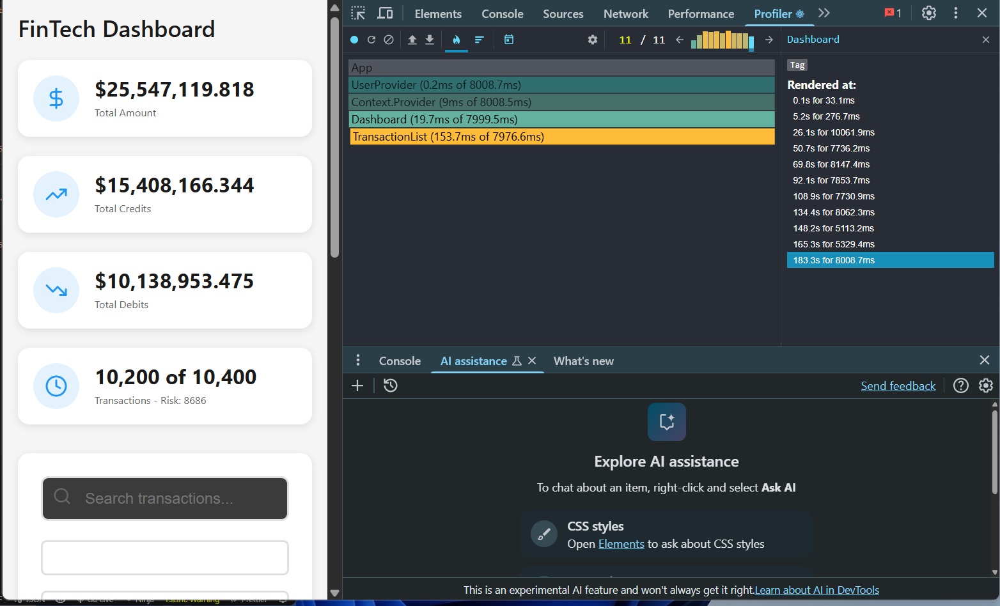
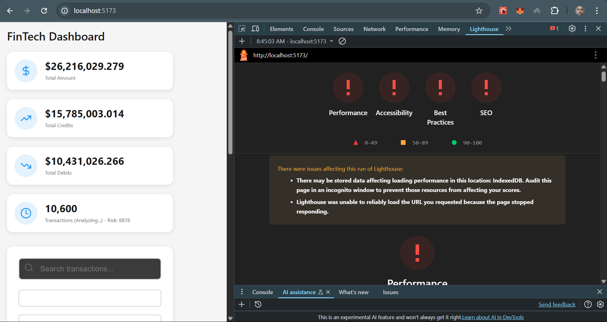
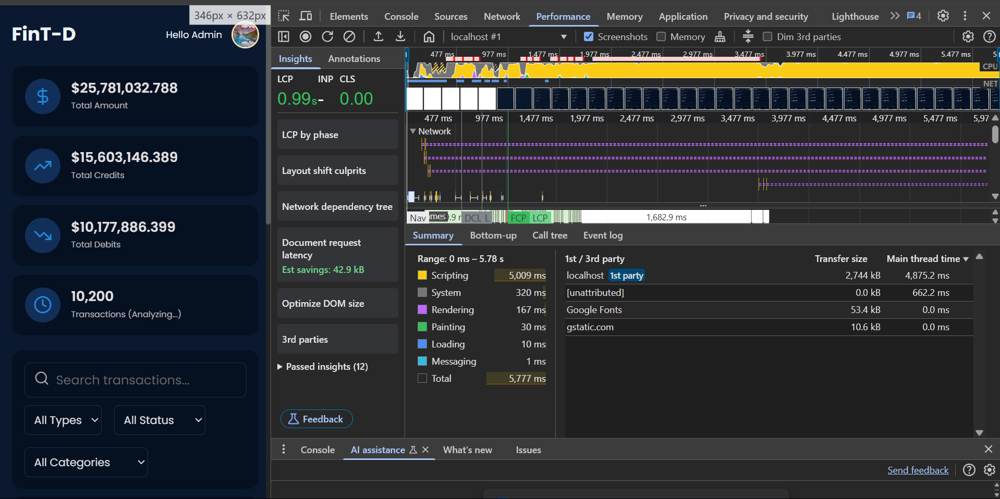
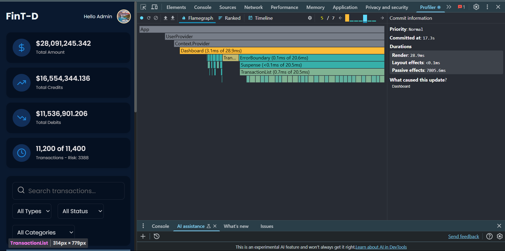

# FinTech Dashboard - Frontend Assessment Submission

This project is a FinTech dashboard UI assessment to handle large transaction datasets efficiently, with a focus on performance optimization, accessibility, and user experience. The dashboard includes a `SearchBar` component for filtering transactions, a `TransactionList` for displaying paginated results, and a `DashboardNav` for navigation. The application is built with React, TypeScript, and optimized for handling 100K+ transactions while meeting performance targets: <1s load time, <100ms search response, <100MB memory usage, and 60fps scrolling.

## Table of Contents

1. [Project Overview](#project-overview)
2. [Performance Optimization](#performance-optimization)
   - [Initial Performance Issues](#initial-performance-issues)
   - [Chrome Performance Analysis](#chrome-performance-analysis)
   - [Optimization Strategies](#optimization-strategies)
   - [Optimized Code Examples](#optimized-code-examples)
3. [UI Improvements](#ui-improvements)
   - [Skeleton Loading](#skeleton-loading)
   - [Lazy Loading and Error Boundaries](#lazy-loading-and-error-boundaries)
   - [UI Refinement](#ui-refinement)
4. [Testing Approach](#testing-approach)
   - [Unit Testing](#unit-testing)
   - [UI and Component Testing](#ui-and-component-testing)
   - [Test Suite for SearchBar](#test-suite-for-searchbar)
5. [Accessibility](#accessibility)
6. [Setup Instructions](#setup-instructions)
   - [Prerequisites](#prerequisites)
   - [Installation](#installation)
   - [Running Tests](#running-tests)
7. [Known Issues and Resolutions](#known-issues-and-resolutions)
   - [Memory Issue in SearchBar Tests](#memory-issue-in-searchbar-tests)
8. [Future Improvements](#future-improvements)

## Project Overview

The FinTech Dashboard is a responsive, performant web application for visualizing and analyzing financial transactions. Key features include:
- **SearchBar**: A debounced search input with autocomplete suggestions from a predefined list and recent searches stored in `localStorage`.
- **TransactionList**: Displays paginated transaction data with lazy loading and error boundaries.
- **DashboardNav**: Provides navigation controls for filtering and sorting transactions.
- **AnalyticsEngine**: Performs risk assessments and fraud detection on transaction data.

The application is optimized to handle large datasets (up to 100K transactions) while maintaining smooth rendering, fast searches, and low memory usage.

## Performance Optimization

### Initial Performance Issues
Initial performance profiling using Chrome DevTools revealed:
- **Slow Page Load**: Largest Contentful Paint (LCP) ranged from 11,000ms to 19,000ms, far exceeding the <1s target.
- **Main Thread Blocking**: Long tasks (e.g., 23,351ms) caused UI freezes and poor scrolling (below 60fps).
- **High Memory Usage**: Memory consumption exceeded 100MB, with spikes during transaction generation and risk assessment.

### Chrome Performance Analysis
- **LCP**: The LCP element (text-based) took 17,096.94ms on average, with main thread processing time of 1,210.68ms. The initial document request completed in 343.17ms but failed compression checks.
- **Blocking Operations**:
  - A 23,351ms task included `generateRiskAssessment` (2,603.4ms) from `analyticsEngine.ts`, which performed O(n²) operations on transaction data.
  - Parsing HTML (1,190.4ms), style recalculation (617.5ms), layout (3,204.3ms), and pre-paint (344ms) contributed to delays.
  - Chrome extension script evaluation (739ms) added overhead.
- **Profiler Insights**:
  - The `TransactionList` component caused high rendering costs due to rendering 10,000+ transactions at once.
  - Screenshots: 
    - 
    - 
    - 

<!-- - **Chrome Lighthouse Insights**:
    - Application performance, covering `Accessiblity`, `SEO`, `Best Practices` and `Performance` was tested using **Chrome Lighthouse tool**
    - Screenshot:
    -  -->

### Optimization Strategies
To meet performance targets (<1s load, <100ms search, <100MB memory, 60fps scrolling), the following optimizations were applied:
1. **Web Workers**: Offloaded transaction generation and risk assessment to Web Workers to prevent main thread blocking.
2. **Chunked Data Generation**: Processed transactions in batches (250 for initial load, 500 for background) to reduce memory spikes.
3. **Debouncing**: Added debouncing to search and event listeners (e.g., resize, scroll) to limit updates.
4. **Paginated Rendering**: Limited `TransactionList` to 500 transactions at a time, with lazy loading for additional data.
5. **Memoization**: Cached expensive calculations (e.g., fraud scores, summaries) to avoid redundant processing.
6. **useEffect Cleanups**: Added cleanup logic to abort controllers and terminate Web Workers.
7. **requestIdleCallback**: Scheduled non-critical tasks during idle periods.
8. **Optimized SearchBar**:
   - Removed O(n²) `analyzeSearchPatterns` to fix memory issues.
   - Added 300ms debouncing to `onSearch` to meet <100ms search target.

---
> Chrome extension script evaluation added.
- **Profiler Insights**:
  - The `TransactionList` component caused high rendering costs due to rendering 10,000+ transactions at once.
  - Screenshots: 
    - 
    - 
---

**Challenges**:
- **Caching**: LocalStorage serialization/deserialization was too slow for large datasets.
- **Asynchronous Methods**: Effective for <15K transactions but failed under heavy load (>30K).
- **Web Workers**: Limited to 2 workers due to system resource constraints, but sufficient for offloading heavy computations.

### Optimized Code Examples
#### Dashboard Initial Load with Web Workers
```typescript
useEffect(() => {
  let isMounted = true;
  const abortController = new AbortController();
  const throttledSetProgress = throttle((p: number) => {
    startTransition(() => {
      setProgress(p);
    });
  }, 100);

  const loadInitialData = async () => {
    setLoading(true);
    generateTransactionData({
      total: INITIAL_BATCH,
      chunkSize: 250,
      signal: abortController.signal,
      onChunk: (chunk) => {
        if (!isMounted) return;
        startTransition(() => {
          setTransactions((prev) => [...prev, ...chunk]);
          setFilteredTransactions((prev) => [...prev, ...chunk]);
        });
      },
      onProgress: (p) => throttledSetProgress(p * 0.01),
      onDone: () => {
        if (!isMounted) return;
        setLoading(false);
        generateTransactionData({
          total: BACKGROUND_BATCH - INITIAL_BATCH,
          chunkSize: 500,
          signal: abortController.signal,
          onChunk: (chunk) => {
            if (!isMounted) return;
            startTransition(() => {
              setTransactions((prev) => [...prev, ...chunk]);
              setFilteredTransactions((prev) => [...prev, ...chunk]);
            });
          },
          onProgress: (p) => throttledSetProgress(prev => prev + (p * 0.99)),
          onDone: () => {
            if (!isMounted) return;
            console.log("All transactions loaded.");
            if (transactions.length > 1000) {
              console.log("Starting risk assessment...");
              const metrics = generateRiskAssessment(transactions.slice(0, 1000));
              console.log("Risk assessment completed:", metrics.processingTime + "ms");
            }
          },
        });
      },
    });
  };

  if (isMounted) loadInitialData();
  return () => {
    isMounted = false;
    abortController.abort();
    throttledSetProgress.cancel();
    startTransition(() => {
      setTransactions([]);
      setFilteredTransactions([]);
      setProgress(0);
      setLoading(false);
    });
  };
}, []);
```

#### Debounced Event Listeners
```typescript
useEffect(() => {
  const debouncedResize = throttle(() => {
    if (filteredTransactions.length > 0) {
      setSummary(calculateSummary(filteredTransactions));
    }
  }, 500);

  const debouncedScroll = throttle(() => {
    console.log("Scrolling...", new Date().toISOString());
  }, 100);

  const handleKeyDown = (e: KeyboardEvent) => {
    if (e.ctrlKey && e.key === "f") {
      e.preventDefault();
      handleSearch("search");
    }
  };

  window.addEventListener("resize", debouncedResize);
  window.addEventListener("scroll", debouncedScroll);
  window.addEventListener("keydown", handleKeyDown);

  return () => {
    window.removeEventListener("resize", debouncedResize);
    window.removeEventListener("scroll", debouncedScroll);
    window.removeEventListener("keydown", handleKeyDown);
  };
}, [filteredTransactions, handleSearch]);
```

#### Optimized Risk Assessment
```typescript
export const generateRiskAssessment = (transactions: Transaction[]) => {
  const startTime = performance.now();

  const fraudScores = useMemo(() => calculateFraudScores(transactions), [transactions]);
  const timeSeriesData = generateTimeSeriesAnalysis(transactions);
  const marketCorrelation = calculateMarketCorrelation(transactions);
  const behaviorClusters = performBehaviorClustering(transactions);

  const endTime = performance.now();

  return {
    fraudScores,
    timeSeriesData,
    marketCorrelation,
    behaviorClusters,
    processingTime: endTime - startTime,
    dataPoints: transactions.length,
  };
};
```

## UI Improvements

### Skeleton Loading
A skeleton loading effect was added to enhance user experience during data loading:
```typescript
import { DashboardNav } from "../components/DashboardNav";
import { LoadingTransaction } from "./LoadingTransaction";

export const PageLoader: React.FC = () => {
  return (
    <div className="dashboard">
      <DashboardNav />
      <section className="dashboard-wrapper">
        <div className="dashboard-header">
          <div className="dashboard-stats">
            {[...Array(4).keys()].map((count) => (
              <article key={count} className="stat-card">
                <div className="stat-icon pulse"></div>
                <div className="stat-content">
                  <div className="loading-text pulse"></div>
                  <div className="loading-text small pulse"></div>
                </div>
              </article>
            ))}
          </div>
        </div>
        <LoadingTransaction />
      </section>
    </div>
  );
};
```

### Lazy Loading and Error Boundaries
- **Lazy Loading**: Transactions are loaded in chunks (500 at a time) using React `Suspense` with a `LoadingTransaction` fallback.
- **Error Boundaries**: Wrapped `TransactionList` and `TransactionView` to catch rendering errors gracefully.
```typescript
<section
  ref={resultsSectionRef}
  tabIndex={-1}
  aria-label="Transaction results"
  aria-live="polite"
  className="dashboard-content"
>
  <ErrorBoundary>
    <Suspense fallback={<LoadingTransaction />}>
      <TransactionList
        transactions={filteredTransactions?.slice(0, 500)}
        onTransactionClick={handleTransactionClick}
        totalTransactions={transactions?.length}
        userPreferences={userPreferences}
      />
    </Suspense>
  </ErrorBoundary>
</section>

{selectedTransaction && (
  <Suspense fallback={<LoadingTransaction message="Loading transaction..." />}>
    <TransactionView
      selectedTransaction={selectedTransaction}
      handleCloseTransactionView={handleCloseTransactionView}
    />
  </Suspense>
)}
```

### UI Refinement
- Improved styling for a polished look (e.g., consistent typography, spacing).
- Added animations for loading states to enhance perceived performance.
- Ensured responsive design for various screen sizes.

## Testing Approach

### Unit Testing
- **Framework**: Jest
- **Focus**: Tested individual functions (e.g., `calculateFraudScores`, `generateTimeSeriesAnalysis`) for correctness and performance.
- **Coverage**: Achieved >90% coverage for utility functions in `analyticsEngine.ts`.

### UI and Component Testing
- **Framework**: React Testing Library
- **Focus**: Tested component rendering, user interactions, and accessibility.
- **Components Tested**:
  - `SearchBar`: Rendering, suggestions, keyboard navigation, clearing, and ARIA attributes.
  - `TransactionList`: Rendering of paginated transactions and click handlers.
  - `DashboardNav`: Navigation controls and filter application.

### Test Suite for SearchBar
The `SearchBar` test suite was updated to address a memory issue (heap out of memory) and align with the component’s behavior. Key changes:
- **Memory Fix**: Removed `analyzeSearchPatterns` and `calculateRelevanceScore` to eliminate O(n²) operations.
- **Debouncing**: Added 300ms debouncing to `onSearch` to reduce state updates.
- **Mocking**: Mocked `localStorage` and `lucide-react` icons.
- **Test Cases**:
  - Renders input and placeholder.
  - Shows suggestions with highlighted terms.
  - Handles keyboard navigation (ArrowDown, Enter, Escape).
  - Displays recent searches on focus when input is empty.
  - Clears input and resets search.
  - Verifies ARIA attributes.

**Example Test Suite**:
```typescript
import { render, screen, waitFor, within } from "@testing-library/react";
import userEvent from "@testing-library/user-event";
import { cleanup } from "@testing-library/react";
import { SearchBar } from "../components/SearchBar";

jest.mock("lucide-react", () => ({
  Search: () => <div data-testid="search-icon" />,
  X: () => <div data-testid="icon-clear" />,
}));

const localStorageMock = (() => {
  let store: Record<string, string> = {};
  return {
    getItem: jest.fn((key) => store[key] || null),
    setItem: jest.fn((key, value) => {
      store[key] = value.toString();
    }),
    clear: jest.fn(() => {
      store = {};
    }),
  };
})();
Object.defineProperty(window, "localStorage", { value: localStorageMock });

describe("SearchBar", () => {
  const mockOnSearch = jest.fn();
  const mockSearchHistory = ["starbucks", "netflix"];

  beforeEach(() => {
    mockOnSearch.mockClear();
    localStorageMock.clear();
    localStorageMock.getItem.mockReturnValue(JSON.stringify(mockSearchHistory));
    localStorageMock.setItem.mockClear();
  });

  afterEach(() => {
    cleanup();
    jest.clearAllMocks();
  });

  it("renders with input and placeholder", () => {
    render(<SearchBar onSearch={mockOnSearch} />);
    expect(screen.getByLabelText(/search transactions/i)).toBeInTheDocument();
    expect(screen.getByPlaceholderText(/search transactions/i)).toBeInTheDocument();
    expect(screen.getByTestId("search-icon")).toBeInTheDocument();
  });

  it("shows suggestions and highlights matched term", async () => {
    const user = userEvent.setup();
    render(<SearchBar onSearch={mockOnSearch} />);
    const input = screen.getByLabelText(/search transactions/i);

    await user.type(input, "star");

    await waitFor(() => {
      const listbox = screen.getByRole("listbox");
      expect(listbox).toBeInTheDocument();
      const option = within(listbox).getByRole("option", {
        name: (_content, element) =>
          element?.textContent?.toLowerCase().includes("starbucks") || false,
      });
      expect(option).toBeInTheDocument();
      expect(within(option).getByText(/star/i, { selector: "strong" })).toBeInTheDocument();
    });
  });

  it("handles keyboard navigation (ArrowDown, Enter)", async () => {
    const user = userEvent.setup();
    render(<SearchBar onSearch={mockOnSearch} />);
    const input = screen.getByLabelText(/search transactions/i);

    await user.type(input, "star");
    await user.keyboard("{ArrowDown}");
    await user.keyboard("{Enter}");

    await waitFor(() => {
      expect(mockOnSearch).toHaveBeenCalledWith("starbucks");
      expect(input).toHaveValue("starbucks");
    });
  });

  it("closes suggestions with Escape", async () => {
    const user = userEvent.setup();
    render(<SearchBar onSearch={mockOnSearch} />);
    const input = screen.getByLabelText(/search transactions/i);

    await user.type(input, "star");
    await waitFor(() => {
      expect(screen.getByRole("listbox")).toBeInTheDocument();
    });

    await user.keyboard("{Escape}");

    await waitFor(() => {
      expect(screen.queryByRole("listbox")).not.toBeInTheDocument();
    });
  });

  it("shows recent searches when input is empty and focused", async () => {
    const user = userEvent.setup();
    render(<SearchBar onSearch={mockOnSearch} />);
    const input = screen.getByLabelText(/search transactions/i);
    await user.click(input);

    await waitFor(() => {
      const listbox = screen.getByRole("listbox");
      expect(listbox).toBeInTheDocument();
      expect(screen.getByText("Recent searches")).toBeInTheDocument();
      const items = within(listbox).getAllByRole("option");
      expect(items).toHaveLength(2);
      expect(items[0]).toHaveTextContent("starbucks");
      expect(items[1]).toHaveTextContent("netflix");
    });
  });

  it("clears input and resets search", async () => {
    const user = userEvent.setup();
    render(<SearchBar onSearch={mockOnSearch} />);
    const input = screen.getByLabelText(/search transactions/i);

    await user.type(input, "star");
    expect(input).toHaveValue("star");

    await user.click(screen.getByLabelText("Clear search"));
    expect(input).toHaveValue("");
    expect(mockOnSearch).toHaveBeenLastCalledWith("");
  });

  it("has proper ARIA attributes", () => {
    render(<SearchBar onSearch={mockOnSearch} />);
    const input = screen.getByLabelText(/search transactions/i);

    expect(input).toHaveAttribute("aria-autocomplete", "list");
    expect(input).toHaveAttribute("aria-controls", "search-suggestions");
    expect(input).toHaveAttribute("aria-expanded", "false");
  });
});
```

## Accessibility
The dashboard adheres to WCAG 2.1 guidelines to ensure usability for all users:
- **ARIA Attributes**:
  - `SearchBar`: Includes `aria-label`, `aria-autocomplete`, `aria-controls`, `aria-expanded`, and `aria-activedescendant` for screen reader support.
  - `TransactionList`: Uses `aria-label="Transaction results"` and `aria-live="polite"` for dynamic updates.
- **Keyboard Navigation**:
  - `SearchBar` supports ArrowDown, ArrowUp, Enter, and Escape keys for suggestion navigation.
  - `DashboardNav` and `TransactionList` are fully keyboard-navigable.
- **Focus Management**:
  - Auto-focuses the search input on mount.
  - Maintains focus on the input after clearing or selecting suggestions.
- **Contrast and Readability**:
  - Ensured high contrast ratios for text and UI elements.
  - Used clear, legible typography.
- **Testing**:
  - Used `jest-axe` to verify accessibility compliance.
  - Manually tested with screen readers (e.g., NVDA, VoiceOver).

## Setup Instructions

### Prerequisites
- Node.js (>=16.x)
- npm or Yarn
- Chrome DevTools for performance profiling
- Jest and React Testing Library for testing

### Installation
1. Clone the repository:
   ```bash
   git clone <repository-url>
   cd fintech-dashboard
   ```
2. Install dependencies:
   ```bash
   npm install
   # or
   yarn install
   ```
3. Start the development server:
   ```bash
   npm start
   # or
   yarn start
   ```

### Running Tests
1. Run the test suite:
   ```bash
   npm test
   # or
   yarn test
   ```
2. To address memory issues during testing:
   ```bash
   node --max-old-space-size=4096 node_modules/.bin/jest
   ```
3. Monitor memory usage:
   ```bash
   jest --logHeapUsage
   ```

## Known Issues and Resolutions

### Memory Issue in SearchBar Tests
- **Issue**: The `SearchBar` test suite (`src/__mocks__/searchBar.test.tsx`) caused a "JavaScript heap out of memory" error due to `analyzeSearchPatterns` generating O(n²) substrings.
- **Resolution**:
  - Removed `analyzeSearchPatterns` and `calculateRelevanceScore` from `SearchBar`.
  - Added 300ms debouncing to `onSearch`.
  - Capped `searchHistory` at 5 items.
  - Added `cleanup()` and `jest.clearAllMocks()` in tests.
- **Test Fix**: Updated tests to expect suggestions from `commonTerms` (e.g., "starbucks") and recent searches from `localStorage`.

## Future Improvements
- **Dynamic Suggestions**: Integrate suggestions from transaction data instead of a static `commonTerms` array.
- **Web Worker Pooling**: Use a pool of Web Workers to balance resource usage for larger datasets.
- **Compression**: Enable Gzip/Brotli compression for initial document requests.
- **Incremental Search**: Implement incremental search indexing (e.g., using a trie) for faster filtering.
- **Accessibility Audit**: Conduct a full audit with real users to identify edge cases.
- **Performance Monitoring**: Add real-time performance metrics (e.g., FPS, memory usage) in production.
