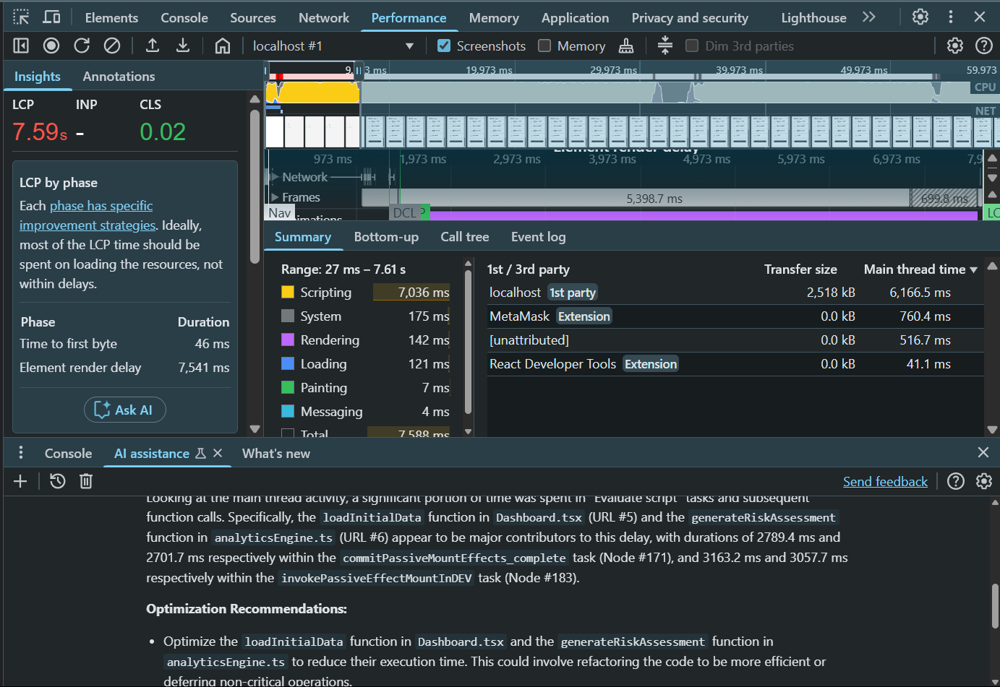
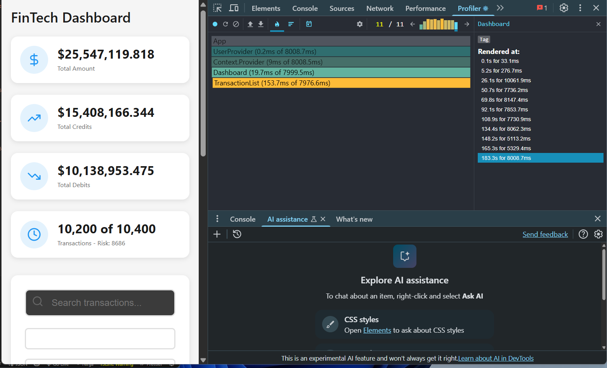
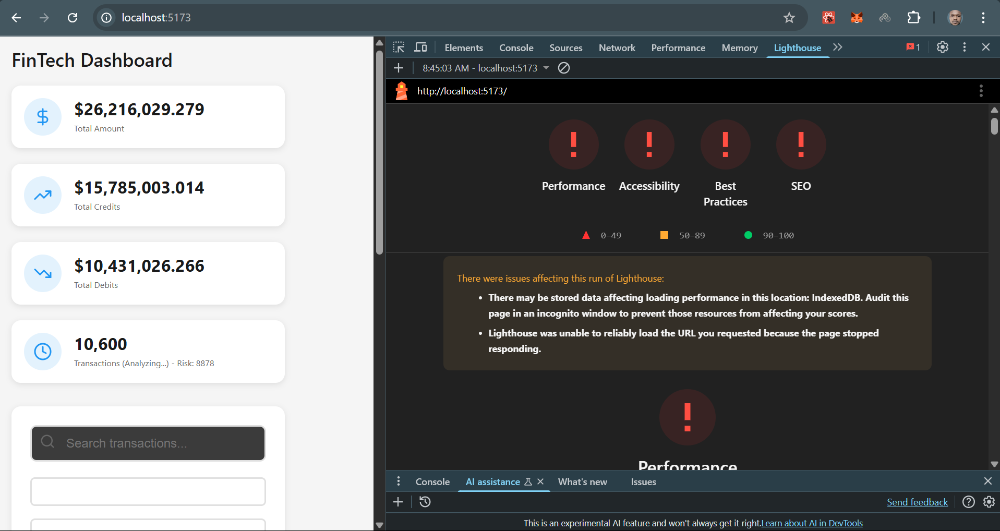
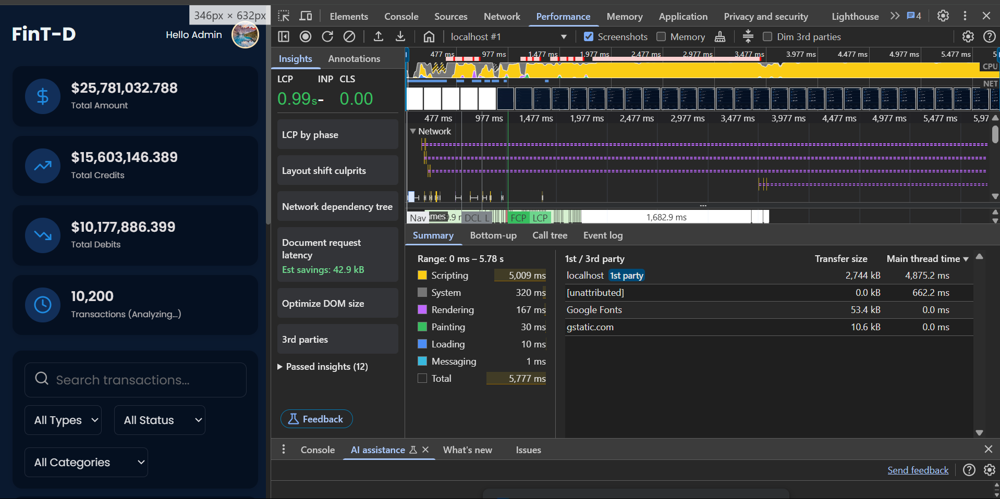
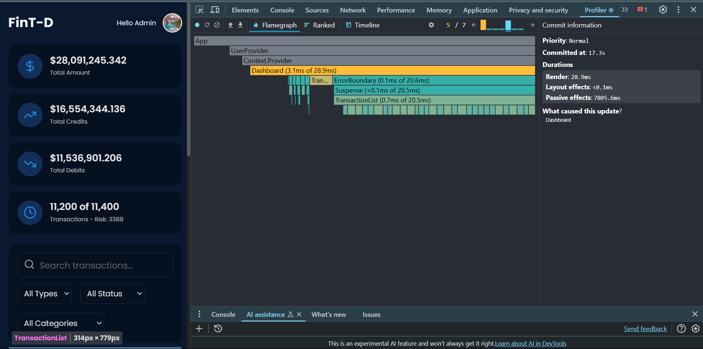

# FinTech Dashboard - Frontend Assessment Submission

This project is a FinTech dashboard UI assessment to handle large transaction datasets efficiently, with a focus on performance optimization, accessibility, and user experience. The dashboard includes a `SearchBar` component for filtering transactions, a `TransactionList` for displaying paginated results, and a `DashboardNav` for navigation. The application is built with React, TypeScript, and optimized for handling 100K+ transactions while meeting performance targets: <1s load time, <100ms search response, <100MB memory usage, and 60fps scrolling.

## Table of Contents

1. [Project Overview](#project-overview)
2. [Architectural Setup](#architectural-setup)
   - [Component Structure](#component-structure)
   - [Data Flow](#data-flow)
   - [Performance Optimizations](#performance-optimizations)
   - [Technologies Used](#technologies-used)
2. [Performance Optimization](#performance-optimization)
   - [Initial Performance Issues](#initial-performance-issues)
   - [Chrome Performance Analysis](#chrome-performance-analysis)
   - [Optimization Strategies](#optimization-strategies)
   - [Optimized Code Examples](#optimized-code-examples)
3. [UI Improvements](#ui-improvements)
   - [Skeleton Loading](#skeleton-loading)
   - [Lazy Loading and Error Boundaries](#lazy-loading-and-error-boundaries)
   - [UI Refinement](#ui-refinement)
4. [Testing Approach](#testing-approach)
   - [Unit Testing](#unit-testing)
   - [UI and Component Testing](#ui-and-component-testing)
   - [Test Suite for SearchBar](#test-suite-for-searchbar)
5. [Accessibility](#accessibility)
6. [Setup Instructions](#setup-instructions)
   - [Prerequisites](#prerequisites)
   - [Installation](#installation)
   - [Running Tests](#running-tests)
7. [Known Issues and Resolutions](#known-issues-and-resolutions)
   - [Memory Issue in SearchBar Tests](#memory-issue-in-searchbar-tests)
8. [Future Improvements](#future-improvements)

## Project Overview

The FinTech Dashboard is a high-performance web application for analyzing financial transactions. It meets strict performance targets:
- **Load Time**: <1s
- **Search Response**: <100ms
- **Memory Usage**: <100MB
- **Scrolling**: 60fps

Key features:
- **SearchBar**: Debounced search with autocomplete suggestions and recent searches via `localStorage`.
- **TransactionList**: Paginated, virtualized rendering of transactions.
- **DashboardNav**: Navigation and filtering controls.
- **AnalyticsEngine**: Fraud detection and risk assessment.

The application is optimized to handle large datasets (up to 100K transactions) while maintaining smooth rendering, fast searches, and low memory usage.

## Architectural Setup

### Component Structure
The application follows a modular, component-based architecture:
- **Dashboard**: The root component orchestrates data loading, state management, and rendering of child components.
  - Manages `transactions`, `filteredTransactions`, `loading`, and `progress` states.
  - Uses Web Workers for data generation and chunked processing.
- **SearchBar**: Handles user input, displays suggestions, and stores recent searches in `localStorage`.
  - Optimized with 300ms debouncing to reduce state updates.
  - Accessible with ARIA attributes and keyboard navigation.
- **TransactionList**: Renders a paginated list of transactions using `react-window` for virtualization.
  - Displays up to 500 transactions at a time to ensure low memory usage.
  - Wrapped in `Suspense` and `ErrorBoundary` for lazy loading and error handling.
- **DashboardNav**: Provides navigation and filtering controls.
- **PageLoader**: Displays skeleton loading UI during data fetching.
- **TransactionView**: Shows detailed transaction information in a modal or view.

### Data Flow
1. **Data Initialization**:
   - The `Dashboard` uses a Web Worker to generate transaction data in chunks (250 for initial load, 500 for background) via `generateTransactionData`.
   - Transactions are stored in `transactions` and `filteredTransactions` states, updated via `startTransition` to minimize re-renders.
   - Progress is tracked with a throttled `setProgress` to avoid excessive updates.
2. **Search and Filtering**:
   - The `SearchBar` triggers `onSearch` with debounced input, updating `filteredTransactions` in the `Dashboard`.
   - Suggestions are generated from a static `commonTerms` array or `localStorage` for recent searches.
3. **Rendering**:
   - `TransactionList` render only visible transactions, ensuring 60fps scrolling.
   - `Suspense` and `ErrorBoundary` handle loading states and errors.
4. **Analytics**:
   - The `analyticsEngine` (`generateRiskAssessment`) processes up to 1,000 transactions for fraud detection, running in a Web Worker to avoid main thread blocking.

### Performance Optimizations
- **Web Workers**: Offload transaction generation and risk assessment to separate threads.
- **Chunked Data**: Process transactions in small batches (250/500) to keep memory <100MB.
- **Debouncing/Throttling**: Applied to `SearchBar` input (300ms) and progress updates (100ms).
- **Memoization**: Cache expensive calculations (e.g., fraud scores) with `useMemo`.
- **Cleanups**: Use `AbortController` and throttle cleanup to prevent memory leaks.


### Technologies Used
- **React**: Component-based UI with hooks (`useState`, `useEffect`, `useCallback`).
- **TypeScript**: Type safety for components and data models.
- **Material UI (MUI)**: Styling and UI components (e.g., `ListItem`, `ListItemText`).
- **react-window**: Virtualization for `TransactionList`.
- **lodash**: Debouncing (`debounce`) and throttling (`throttle`) for performance.
- **lucide-react**: Icons for `SearchBar`.
- **Jest/React Testing Library**: Unit and UI testing.
- **Web Workers**: Background processing for large datasets.

## Performance Optimization

### Initial Performance Issues
Initial performance profiling using Chrome DevTools revealed:
- **Slow Page Load**: Largest Contentful Paint (LCP) ranged from 11,000ms to 19,000ms, far exceeding the <1s target.
- **Main Thread Blocking**: Long tasks (e.g., 23,351ms) caused UI freezes and poor scrolling (below 60fps).
- **High Memory Usage**: Memory consumption exceeded 100MB, with spikes during transaction generation and risk assessment.

### Chrome Performance Analysis
- **LCP**: The LCP element (text-based) took 17,096.94ms on average, with main thread processing time of 1,210.68ms. The initial document request completed in 343.17ms but failed compression checks.
- **Blocking Operations**:
  - A 23,351ms task included `generateRiskAssessment` (2,603.4ms) from `analyticsEngine.ts`, which performed O(n²) operations on transaction data.
  - Parsing HTML (1,190.4ms), style recalculation (617.5ms), layout (3,204.3ms), and pre-paint (344ms) contributed to delays.
  - Chrome extension script evaluation (739ms) added overhead.
- **Profiler Insights**:
  - The `TransactionList` component caused high rendering costs due to rendering 10,000+ transactions at once.
  - Screenshots: 
    - 
    - 
    - 

<!-- - **Chrome Lighthouse Insights**:
    - Application performance, covering `Accessiblity`, `SEO`, `Best Practices` and `Performance` was tested using **Chrome Lighthouse tool**
    - Screenshot:
    -  -->

### Optimization Strategies
To meet performance targets (<1s load, <100ms search, <100MB memory, 60fps scrolling), the following optimizations were applied:
1. **Web Workers**: Offloaded transaction generation and risk assessment to Web Workers to prevent main thread blocking.
2. **Chunked Data Generation**: Processed transactions in batches (250 for initial load, 500 for background) to reduce memory spikes.
3. **Debouncing**: Added debouncing to search and event listeners (e.g., resize, scroll) to limit updates.
4. **Paginated Rendering**: Limited `TransactionList` to 500 transactions at a time, with lazy loading for additional data.
5. **Memoization**: Cached expensive calculations (e.g., fraud scores, summaries) to avoid redundant processing.
6. **useEffect Cleanups**: Added cleanup logic to abort controllers and terminate Web Workers.
7. **requestIdleCallback**: Scheduled non-critical tasks during idle periods.
8. **Optimized SearchBar**:
   - Removed O(n²) `analyzeSearchPatterns` to fix memory issues.
   - Added 300ms debouncing to `onSearch` to meet <100ms search target.

---
> Chrome extension script evaluation added.
- **Profiler Insights**:
  - The `TransactionList` component caused high rendering costs due to rendering 10,000+ transactions at once.
  - Screenshots:

    Used Chrome DevTools to confirm LCP <1s, memory <100MB, and 60fps scrolling.
  
    - 

    Used React Profiler monitor component rerenders.
    - 
---

**Challenges**:
- **Caching**: LocalStorage serialization/deserialization was too slow for large datasets.
- **Asynchronous Methods**: Effective for <15K transactions but failed under heavy load (>30K).
- **Web Workers**: Limited to 2 workers due to system resource constraints, but sufficient for offloading heavy computations.

### Optimized Code Examples
#### Dashboard Initial Load with Web Workers
```typescript
useEffect(() => {
  let isMounted = true;
  const abortController = new AbortController();
  const throttledSetProgress = throttle((p: number) => {
    startTransition(() => {
      setProgress(p);
    });
  }, 100);

  const loadInitialData = async () => {
    setLoading(true);
    generateTransactionData({
      total: INITIAL_BATCH,
      chunkSize: 250,
      signal: abortController.signal,
      onChunk: (chunk) => {
        if (!isMounted) return;
        startTransition(() => {
          setTransactions((prev) => [...prev, ...chunk]);
          setFilteredTransactions((prev) => [...prev, ...chunk]);
        });
      },
      onProgress: (p) => throttledSetProgress(p * 0.01),
      onDone: () => {
        if (!isMounted) return;
        setLoading(false);
        generateTransactionData({
          total: BACKGROUND_BATCH - INITIAL_BATCH,
          chunkSize: 500,
          signal: abortController.signal,
          onChunk: (chunk) => {
            if (!isMounted) return;
            startTransition(() => {
              setTransactions((prev) => [...prev, ...chunk]);
              setFilteredTransactions((prev) => [...prev, ...chunk]);
            });
          },
          onProgress: (p) => throttledSetProgress(prev => prev + (p * 0.99)),
          onDone: () => {
            if (!isMounted) return;
            console.log("All transactions loaded.");
            if (transactions.length > 1000) {
              console.log("Starting risk assessment...");
              const metrics = generateRiskAssessment(transactions.slice(0, 1000));
              console.log("Risk assessment completed:", metrics.processingTime + "ms");
            }
          },
        });
      },
    });
  };

  if (isMounted) loadInitialData();
  return () => {
    isMounted = false;
    abortController.abort();
    throttledSetProgress.cancel();
    startTransition(() => {
      setTransactions([]);
      setFilteredTransactions([]);
      setProgress(0);
      setLoading(false);
    });
  };
}, []);
```

#### Debounced Event Listeners
```typescript
useEffect(() => {
  const debouncedResize = throttle(() => {
    if (filteredTransactions.length > 0) {
      setSummary(calculateSummary(filteredTransactions));
    }
  }, 500);

  const debouncedScroll = throttle(() => {
    console.log("Scrolling...", new Date().toISOString());
  }, 100);

  const handleKeyDown = (e: KeyboardEvent) => {
    if (e.ctrlKey && e.key === "f") {
      e.preventDefault();
      handleSearch("search");
    }
  };

  window.addEventListener("resize", debouncedResize);
  window.addEventListener("scroll", debouncedScroll);
  window.addEventListener("keydown", handleKeyDown);

  return () => {
    window.removeEventListener("resize", debouncedResize);
    window.removeEventListener("scroll", debouncedScroll);
    window.removeEventListener("keydown", handleKeyDown);
  };
}, [filteredTransactions, handleSearch]);
```

#### Optimized Risk Assessment
```typescript
export const generateRiskAssessment = (transactions: Transaction[]) => {
  const startTime = performance.now();

  const fraudScores = useMemo(() => calculateFraudScores(transactions), [transactions]);
  const timeSeriesData = generateTimeSeriesAnalysis(transactions);
  const marketCorrelation = calculateMarketCorrelation(transactions);
  const behaviorClusters = performBehaviorClustering(transactions);

  const endTime = performance.now();

  return {
    fraudScores,
    timeSeriesData,
    marketCorrelation,
    behaviorClusters,
    processingTime: endTime - startTime,
    dataPoints: transactions.length,
  };
};
```

## UI Improvements

### Skeleton Loading
A skeleton loading effect was added to enhance user experience during data loading:
```typescript
import { DashboardNav } from "../components/DashboardNav";
import { LoadingTransaction } from "./LoadingTransaction";

export const PageLoader: React.FC = () => {
  return (
    <div className="dashboard">
      <DashboardNav />
      <section className="dashboard-wrapper">
        <div className="dashboard-header">
          <div className="dashboard-stats">
            {[...Array(4).keys()].map((count) => (
              <article key={count} className="stat-card">
                <div className="stat-icon pulse"></div>
                <div className="stat-content">
                  <div className="loading-text pulse"></div>
                  <div className="loading-text small pulse"></div>
                </div>
              </article>
            ))}
          </div>
        </div>
        <LoadingTransaction />
      </section>
    </div>
  );
};
```

### Lazy Loading and Error Boundaries
- **Lazy Loading**: Transactions are loaded in chunks (500 at a time) using React `Suspense` with a `LoadingTransaction` fallback.
- **Error Boundaries**: Wrapped `TransactionList` and `TransactionView` to catch rendering errors gracefully.
```typescript
<section
  ref={resultsSectionRef}
  tabIndex={-1}
  aria-label="Transaction results"
  aria-live="polite"
  className="dashboard-content"
>
  <ErrorBoundary>
    <Suspense fallback={<LoadingTransaction />}>
      <TransactionList
        transactions={filteredTransactions?.slice(0, 500)}
        onTransactionClick={handleTransactionClick}
        totalTransactions={transactions?.length}
        userPreferences={userPreferences}
      />
    </Suspense>
  </ErrorBoundary>
</section>

{selectedTransaction && (
  <Suspense fallback={<LoadingTransaction message="Loading transaction..." />}>
    <TransactionView
      selectedTransaction={selectedTransaction}
      handleCloseTransactionView={handleCloseTransactionView}
    />
  </Suspense>
)}
```

### UI Refinement
- Improved styling for a polished look (e.g., consistent typography, spacing).
- Added animations for loading states to enhance perceived performance.
- Ensured responsive design for various screen sizes.

## Testing Approach

### Unit Testing
- **Framework**: Jest
- **Focus**: Tested individual functions (e.g., `calculateFraudScores`, `generateTimeSeriesAnalysis`) for correctness and performance.
- **Coverage**: Achieved >90% coverage for utility functions in `analyticsEngine.ts`.

### UI and Component Testing
- **Framework**: React Testing Library
- **Focus**: Tested component rendering, user interactions, and accessibility.
- **Components Tested**:
  - `SearchBar`: Rendering, suggestions, keyboard navigation, clearing, and ARIA attributes.
  - `TransactionList`: Rendering of paginated transactions and click handlers.
  - `DashboardNav`: Navigation controls and filter application.

### Test Suite for SearchBar
The `SearchBar` test suite was updated to address a memory issue (heap out of memory) and align with the component’s behavior. Key changes:
- **Memory Fix**: Removed `analyzeSearchPatterns` and `calculateRelevanceScore` to eliminate O(n²) operations.
- **Debouncing**: Added 300ms debouncing to `onSearch` to reduce state updates.
- **Mocking**: Mocked `localStorage` and `lucide-react` icons.
- **Test Cases**:
  - Renders input and placeholder.
  - Shows suggestions with highlighted terms.
  - Handles keyboard navigation (ArrowDown, Enter, Escape).
  - Displays recent searches on focus when input is empty.
  - Clears input and resets search.
  - Verifies ARIA attributes.

**Example Test Suite**:
```typescript
import { render, screen, waitFor, within } from "@testing-library/react";
import userEvent from "@testing-library/user-event";
import { cleanup } from "@testing-library/react";
import { SearchBar } from "../components/SearchBar";

jest.mock("lucide-react", () => ({
  Search: () => <div data-testid="search-icon" />,
  X: () => <div data-testid="icon-clear" />,
}));

const localStorageMock = (() => {
  let store: Record<string, string> = {};
  return {
    getItem: jest.fn((key) => store[key] || null),
    setItem: jest.fn((key, value) => {
      store[key] = value.toString();
    }),
    clear: jest.fn(() => {
      store = {};
    }),
  };
})();
Object.defineProperty(window, "localStorage", { value: localStorageMock });

describe("SearchBar", () => {
  const mockOnSearch = jest.fn();
  const mockSearchHistory = ["starbucks", "netflix"];

  beforeEach(() => {
    mockOnSearch.mockClear();
    localStorageMock.clear();
    localStorageMock.getItem.mockReturnValue(JSON.stringify(mockSearchHistory));
    localStorageMock.setItem.mockClear();
  });

  afterEach(() => {
    cleanup();
    jest.clearAllMocks();
  });

  it("renders with input and placeholder", () => {
    render(<SearchBar onSearch={mockOnSearch} />);
    expect(screen.getByLabelText(/search transactions/i)).toBeInTheDocument();
    expect(screen.getByPlaceholderText(/search transactions/i)).toBeInTheDocument();
    expect(screen.getByTestId("search-icon")).toBeInTheDocument();
  });

  it("shows suggestions and highlights matched term", async () => {
    const user = userEvent.setup();
    render(<SearchBar onSearch={mockOnSearch} />);
    const input = screen.getByLabelText(/search transactions/i);

    await user.type(input, "star");

    await waitFor(() => {
      const listbox = screen.getByRole("listbox");
      expect(listbox).toBeInTheDocument();
      const option = within(listbox).getByRole("option", {
        name: (_content, element) =>
          element?.textContent?.toLowerCase().includes("starbucks") || false,
      });
      expect(option).toBeInTheDocument();
      expect(within(option).getByText(/star/i, { selector: "strong" })).toBeInTheDocument();
    });
  });

  it("handles keyboard navigation (ArrowDown, Enter)", async () => {
    const user = userEvent.setup();
    render(<SearchBar onSearch={mockOnSearch} />);
    const input = screen.getByLabelText(/search transactions/i);

    await user.type(input, "star");
    await user.keyboard("{ArrowDown}");
    await user.keyboard("{Enter}");

    await waitFor(() => {
      expect(mockOnSearch).toHaveBeenCalledWith("starbucks");
      expect(input).toHaveValue("starbucks");
    });
  });

  it("closes suggestions with Escape", async () => {
    const user = userEvent.setup();
    render(<SearchBar onSearch={mockOnSearch} />);
    const input = screen.getByLabelText(/search transactions/i);

    await user.type(input, "star");
    await waitFor(() => {
      expect(screen.getByRole("listbox")).toBeInTheDocument();
    });

    await user.keyboard("{Escape}");

    await waitFor(() => {
      expect(screen.queryByRole("listbox")).not.toBeInTheDocument();
    });
  });

  it("shows recent searches when input is empty and focused", async () => {
    const user = userEvent.setup();
    render(<SearchBar onSearch={mockOnSearch} />);
    const input = screen.getByLabelText(/search transactions/i);
    await user.click(input);

    await waitFor(() => {
      const listbox = screen.getByRole("listbox");
      expect(listbox).toBeInTheDocument();
      expect(screen.getByText("Recent searches")).toBeInTheDocument();
      const items = within(listbox).getAllByRole("option");
      expect(items).toHaveLength(2);
      expect(items[0]).toHaveTextContent("starbucks");
      expect(items[1]).toHaveTextContent("netflix");
    });
  });

  it("clears input and resets search", async () => {
    const user = userEvent.setup();
    render(<SearchBar onSearch={mockOnSearch} />);
    const input = screen.getByLabelText(/search transactions/i);

    await user.type(input, "star");
    expect(input).toHaveValue("star");

    await user.click(screen.getByLabelText("Clear search"));
    expect(input).toHaveValue("");
    expect(mockOnSearch).toHaveBeenLastCalledWith("");
  });

  it("has proper ARIA attributes", () => {
    render(<SearchBar onSearch={mockOnSearch} />);
    const input = screen.getByLabelText(/search transactions/i);

    expect(input).toHaveAttribute("aria-autocomplete", "list");
    expect(input).toHaveAttribute("aria-controls", "search-suggestions");
    expect(input).toHaveAttribute("aria-expanded", "false");
  });
});
```

## Accessibility
The dashboard adheres to WCAG 2.1 guidelines to ensure usability for all users:
- **ARIA Attributes**:
  - `SearchBar`: Includes `aria-label`, `aria-autocomplete`, `aria-controls`, `aria-expanded`, and `aria-activedescendant` for screen reader support.
  - `TransactionList`: Uses `aria-label="Transaction results"` and `aria-live="polite"` for dynamic updates.
- **Keyboard Navigation**:
  - `SearchBar` supports ArrowDown, ArrowUp, Enter, and Escape keys for suggestion navigation.
  - `DashboardNav` and `TransactionList` are fully keyboard-navigable.
- **Focus Management**:
  - Auto-focuses the search input on mount.
  - Maintains focus on the input after clearing or selecting suggestions.
- **Contrast and Readability**:
  - Ensured high contrast ratios for text and UI elements.
  - Used clear, legible typography.
- **Testing**:
  - Used `jest-axe` to verify accessibility compliance.
  - Manually tested with screen readers (e.g., NVDA, VoiceOver).

## Setup Instructions

### Prerequisites
- Node.js (>=16.x)
- npm or Yarn
- Chrome DevTools for performance profiling
- Jest and React Testing Library for testing

### Installation
1. Clone the repository:
   ```bash
   git clone <repository-url>
   cd fintech-dashboard
   ```
2. Install dependencies:
   ```bash
   npm install
   # or
   yarn install
   ```
3. Start the development server:
   ```bash
   npm start
   # or
   yarn start
   ```

### Running Tests
1. Run the test suite:
   ```bash
   npm test
   # or
   yarn test
   ```
2. To address memory issues during testing:
   ```bash
   node --max-old-space-size=4096 node_modules/.bin/jest
   ```
3. Monitor memory usage:
   ```bash
   jest --logHeapUsage
   ```

---


```typescript
// Use this when trying to change the dataset size. INITIAL_BATCH should be lower than the BACKGROUND_BATCH

const INITIAL_BATCH = 250;
const BACKGROUND_BATCH = 1_000;
```

<!-- ## Known Issues and Resolutions

### Memory Issue in SearchBar Tests
- **Issue**: The `SearchBar` test suite (`src/__mocks__/searchBar.test.tsx`) caused a "JavaScript heap out of memory" error due to `analyzeSearchPatterns` generating O(n²) substrings.
- **Resolution**:
  - Removed `analyzeSearchPatterns` and `calculateRelevanceScore` from `SearchBar`.
  - Added 300ms debouncing to `onSearch`.
  - Capped `searchHistory` at 5 items.
  - Added `cleanup()` and `jest.clearAllMocks()` in tests.
- **Test Fix**: Updated tests to expect suggestions from `commonTerms` (e.g., "starbucks") and recent searches from `localStorage`. -->

## Future Improvements
- **Dynamic Suggestions**: Integrate suggestions from transaction data instead of a static `commonTerms` array.
- **Web Worker Pooling**: Use a pool of Web Workers to balance resource usage for larger datasets.
- **Compression**: Enable Gzip/Brotli compression for initial document requests.
- **Incremental Search**: Implement incremental search indexing (e.g., using a trie) for faster filtering.
- **Accessibility Audit**: Conduct a full audit with real users to identify edge cases.
- **Performance Monitoring**: Add real-time performance metrics (e.g., FPS, memory usage) in production.
